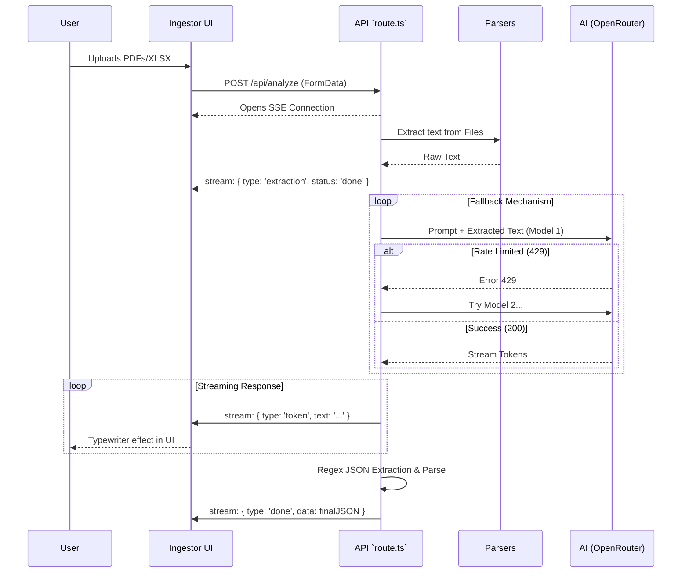

# IntelliCredit — Technical Architecture & Code Deep Dive

IntelliCredit is a modern, AI-powered Credit Decisioning Engine built to analyze complex financial documents (bank statements, annual reports, GST returns) and provide rapid, automated credit appraisals. 

This document explains the system's architecture, data flows, core components, and how the AI integration is orchestrated.

---

## 1. High-Level Architecture Block Diagram

```mermaid
graph TD
    %% User Interface
    subgraph Frontend [Next.js Client (React + Tailwind)]
        UI[User Interface]
        DB[Dashboard]
        ING[Document Ingestor]
        PORT[Portfolio & Sub-screens]
    end

    %% API Layer
    subgraph Backend [Next.js API Routes (Serverless)]
        API_ANALYZE[/api/analyze]
        API_TEST[/api/test-connection]
    end

    %% Processing
    subgraph Document Processing Layer
        PDF[pdf-parse]
        XLSX[xlsx]
        REG[Regex Financial Extractor]
    end

    %% External
    subgraph External AI Services
        OR[OpenRouter API]
        LLM_1[LLaMA 3.3 70B]
        LLM_2[Mistral 24B]
        LLM_n[Other Fallback Models]
    end

    %% Connections
    UI -->|Upload Documents| ING
    ING -->|FormData (Files)| API_ANALYZE
    
    API_ANALYZE -->|Buffer| PDF
    API_ANALYZE -->|Buffer| XLSX
    
    PDF -->|Raw Text| REG
    XLSX -->|Raw Text| REG
    
    REG -->|Text + Prompts| OR
    OR -->|Streaming SSE| API_ANALYZE
    API_ANALYZE -->|Server-Sent Events| ING
    
    OR -->|Route to| LLM_1
    OR -.->|Fallback if 429| LLM_2
    OR -.->|Fallback if 429| LLM_n
```

---

## 2. Core Technology Stack

*   **Framework:** **Next.js 15.0** (App Router architecture)
*   **Language:** **TypeScript** (Strict mode for end-to-end type safety)
*   **Styling:** **Tailwind CSS 3.4** (Custom utility classes, animations, glassmorphism)
*   **Icons:** **Lucide React**
*   **Charts:** **Recharts** (Radar, Bar, Line charts for financial visualization)
*   **Document Parsers:**
    *   `pdf-parse@1.1.1`: Classic, reliable server-side PDF text extraction.
    *   `xlsx`: Server-side extraction of Excel/CSV financial data.
*   **AI Orchestration:** **OpenRouter API** routing to various open-weight LLMs with an intelligent fallback mechanism.

---

## 3. Directory Structure & Key Files

```text
intellicredit/
├── app/
│   ├── api/
│   │   ├── analyze/
│   │   │   └── route.ts         # CORE: Document extraction & AI Orchestration
│   │   └── test-connection/
│   │       └── route.ts         # Utility: OpenRouter API health check
│   ├── globals.css              # Global styles, custom animations, Tailwind directives
│   ├── layout.tsx               # Root layout, meta tags, font configuration
│   └── page.tsx                 # Main application shell (Sidebar + Topbar + Navigation)
├── components/
│   ├── screens/
│   │   ├── Dashboard.tsx        # High-level metrics, charts, aggregate portfolio view
│   │   ├── Ingestor.tsx         # Drag-and-drop file upload, SSE progress UI
│   │   ├── Portfolio.tsx        # Interactive list of appraisals with detailed slide-out
│   │   ├── Comparison.tsx       # Peer comparison engine with auto-selection
│   │   ├── CAM.tsx              # Credit Appraisal Memo generator with export
│   │   ├── AuditTrail.tsx       # Compliance and system logs
│   │   ├── Settings.tsx         # System configuration
│   │   └── EarlyWarning.tsx     # Risk signal monitoring deck
│   └── ui/                      # Reusable modular UI components (optional future extraction)
├── data/
│   └── data.ts                  # Mock data for Dashboard, Portfolio, and Logs
├── tailwind.config.ts           # Design system tokens (colors, animations)
└── next.config.ts               # Next.js Server & Build configuration
```

---

## 4. API & Data Flow (The `analyze` Route)

The core engine of IntelliCredit is the POST request handler in `app/api/analyze/route.ts`. It utilizes **Server-Sent Events (SSE)** to stream real-time updates back to the front-end, preventing Vercel/Next.js function timeouts and providing an engaging UI.

### Sequence Diagram



### Detailed Breakdown of `route.ts`:

1.  **File Reception:** Receives `multipart/form-data`.
2.  **File Parsing Loop:** Iterates through `File[]`.
    *   If `.pdf`, converts to `ArrayBuffer`, pipes to `pdf-parse`.
    *   If `.xlsx`, pipes to `xlsx`.
    *   Aggregates all raw text into one massive string (`allText`).
3.  **Truncation:** Caps text at ~80,000 characters to prevent max-token limits on LLMs.
4.  **Multi-Model Sequential Fallback (The AI Router):**
    *   Iterates through an array of free models (`Llama 3.3 70B`, `Mistral 24B`, `Qwen 3 Coder`, etc.).
    *   If a model returns `429 Too Many Requests` or `404`, it immediately falls back to the next model in the list.
    *   This guarantees that the platform stays online even if a specific free model cluster is temporarily full.
5.  **Streaming & Prompting:**
    *   Sends a rigid system prompt requiring a strict JSON schema output matching your 5C framework (Character, Capacity, Capital, Collateral, Conditions).
    *   Tokens are streamed back to the client using `ReadableStream` and `TextEncoder` in real-time.
6.  **Robust JSON Extraction:**
    *   Free models often inject conversational filler (e.g., *"Here is your JSON:*").
    *   A regex (`/\{[\s\S]*\}/`) actively hunts for the outermost curly braces `{ ... }` to safely extract and parse the actual data payload.
7.  **Data Hydration:** Assigns standard UI tailwind colors (`tag-green`, `tag-amber`, etc.) to the raw AI response before shipping it securely to the client.

---

## 5. The "Demo Mode" Fallback Engine (Offline Resilience)

If the active internet connection drops, open-router goes completely offline, or all 5 models are rate-limited, the system engages a **Smart Fallback Engine**. It does *not* crash.

1.  **`inferCompanyName()` & `inferSector()`:** Regex algorithms run on the uploaded filenames to guess the company and sector ("SunrisePharma" -> "Pharmaceuticals").
2.  **`extractFinancialsFromText()`:** An advanced local Regex miner that scans the extracted `allText` for raw financial patterns:
    *   Turnover (`₹\d+ Cr`)
    *   Net Worth (`Shareholders Equity \d+`)
    *   DSCR / Debt-Equity (`\d.\d×`)
    *   CIN (`L...PLC...`)
3.  **Score Construction:** It takes these real numbers and mathematically generates highly plausible "Demo" 5C scores using the company name as a mathematical seed (so reloading the same company yields the exact same logical scores).
4.  **Simulated Streaming:** It chops this generated JSON into 25-character chunks and streams them back via `setTimeout` manually bypassing the AI entirely but preserving the exact UI user experience.

---

## 6. Frontend UI Components

### `Ingestor.tsx` (The Engine Room)
*   **Drag & Drop Zone:** Beautifully animated glassmorphism dropzone.
*   **SSE Client:** Listens to `data: ` streams. Reconstructs tokens, populating the `explainChain` incrementally.
*   **Result Presentation:** Upon completion, switches UI state to show the finalized 5Cs, composite score, Verdict (APPROVE/REJECT), and peer comparisons.

### `Portfolio.tsx` (Deep Dive)
*   Table view of all applicants.
*   Clicking a row triggers a smooth slide-out panel (drawer) from the right containing a micro-dashboard for that specific borrower. Includes `Recharts` Radar graphs and animated progress bars for their 5 scores.

### `Comparison.tsx` (The Battleground)
*   Renders borrowers side-by-side.
*   A button iterates over the array, summing the `compositeScore`, mathematically calculating an "AI Confidence Score" distance between competitors, and highlights the winner natively pushing everything else to a dimmed state via Tailwind `opacity-40` modifiers.

### `globals.css` (The Vibe)
All animations are driven exclusively by pure CSS for maximum framerate performance:
*   `@keyframes slideUp`: For card entrance.
*   `@keyframes pulse-slow`: For background ambiance.
*   `@keyframes pulse-border`: For active analyzing states.
*   `@keyframes wiggle`: For minor call-to-action attention grabbing (e.g., the notification bell).

---

## Summary
IntelliCredit represents a marriage between **Hardcore Document Parsing** (Node.js Buffer manipulation), **Cloud AI Orchestration** (Multi-model LLM streaming), and **Premium Presentation** (React concurrent rendering with CSS-accelerated animations).
