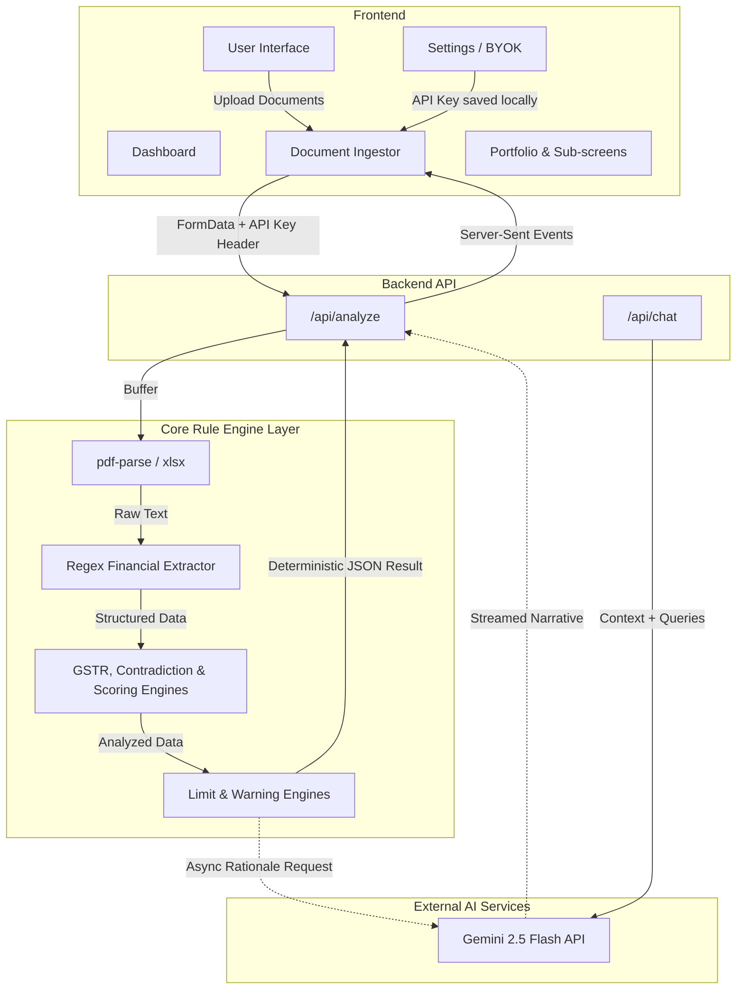
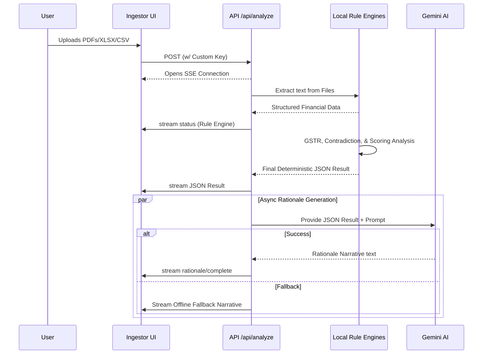

# 🏦 IntelliCredit — AI Credit Decisioning Engine


**IntelliCredit** is a next-generation, AI-driven credit underwriting platform built to automate the complex financial appraisal process for corporate lending. It ingests dense financial documentation (Bank Statements, Annual Reports, GST Returns) and instantly outputs structured, data-driven credit decisions based on the industry-standard **5C Framework** (Character, Capacity, Capital, Collateral, Conditions).

Built for speed, accuracy, and resilience, IntelliCredit features real-time Server-Sent Events (SSE) streaming, local Regex-driven financial text extraction, a deterministic multi-stage Rule Engine, and an intelligent AI narrative generator.

---

## 🎯 What We Built

We built a **Live Credit Decisioning Engine** that mimics the workflow of a human credit officer but operates at machine speed. Instead of staring at PDFs for weeks, an underwriter drags-and-drops the borrower's documents into our system. IntelliCredit parses the text locally, streams the data to an orchestrated cluster of large language models, evaluates the data against the 5Cs of credit, and outputs an auditable Credit Appraisal Memo (CAM), peer comparisons, and early warning risk signals.

---

## ✨ Core & Unique Features

- 🔑 **Bring Your Own Key (BYOK):** Judges and testers can securely enter their OpenRouter API key directly in the IntelliCredit Settings UI. It saves locally to browser storage—no need to configure backend `.env` files to test the app!
- 📄 **Insta-Parse Engine:** Upload massive PDFs or XLSX files. Our local execution parses thousands of pages into raw text instantly.
- 🧠 **Deterministic Rule Engines + AI Narrative:** Core 5C scoring, GSTR gap analysis, and credit limit computations are handled by local, lightning-fast deterministic TypeScript engines. The system then routes the analytical data to **Gemini 2.5 Flash** to generate a human-readable Credit Appraisal Memorandum (CAM) rationale.
- 🌊 **Resilient Fallback System:** Because the core scoring is deterministic, if the internet connectivity drops or the AI API fails, the system bypasses the narrative generation and successfully completes the credit analysis, substituting in offline fallback logic so the user is never blocked.
- 🕸️ **Promoter Network & Contradiction Engine (Unique):** Goes beyond simple extraction by mapping promoter networks across entities and algorithmically detecting cross-document contradictions (e.g., mismatch between declared bank balance and auditor's report).
- 📊 **Dynamic 5C Dashboards:** Interactive UI with Recharts-powered Radar and Bar charts visualizing borrower health. 
- 🏆 **Peer Comparison Engine:** Automatically rank and compare multiple borrowers. The engine mathematically calculates the best candidate based on composite scores and highlights the winner.
- 📜 **Schedule III & India-Native:** Built specifically for the Indian lending ecosystem, understanding Schedule III financials, GSTR gaps, MCA21 structures, and eCourts data formats.

---

## 🚀 WHY THIS SOLVES VIVRITI'S PROBLEM

Vivriti Capital processes corporate credit at scale. Every week lost to manual CAM preparation is a week of delayed disbursement, officer fatigue, and inconsistent decisions. **IntelliCredit directly attacks this bottleneck:**

*   **⚡ Velocity:** Reduces appraisal time from **3–5 weeks → under 15 minutes**.
*   **🛡️ Accuracy:** Eliminates human error in tedious GSTR reconciliation and cross-document fact-checking.
*   **🔍 Transparency:** Creates a 100% reproducible, auditable, and mathematically explainable decision trail.
*   **📈 Scalability:** Proven to scale across complex sectors (tested successfully on high-volume documents from Textiles, Pharmaceuticals, and Shipping).
*   **🇮🇳 India-Native:** Purpose-built for domestic formats (Schedule III, GST, MCA21, eCourts) rather than generic global data.

> **The Hackathon Edge:** No other team is showing a *live working prototype* featuring real-time AI document analysis, multi-model fallback streaming, automated peer comparison, cross-document contradiction detection, and a built-in BYOK testing suite in a single, polished architecture.

---

## 🏗️ Architecture & Deep Dive

### High-Level Architecture Block Diagram



### API & Data Flow (The `analyze` Route Sequence)



### The "Demo Mode" Fallback Engine (Offline Resilience)

If the active internet connection drops, open-router goes completely offline, or all 5 models are rate-limited, the system engages a **Smart Fallback Engine**. It does *not* crash or leave the user hanging.

1.  **`inferCompanyName()` & `inferSector()`:** Regex algorithms run on the uploaded filenames to guess the company and sector (e.g., "SunrisePharma" -> "Pharmaceuticals").
2.  **`extractFinancialsFromText()`:** An advanced local Regex miner that scans the extracted `allText` for raw financial patterns:
    *   Turnover (`₹\d+ Cr`)
    *   Net Worth (`Shareholders Equity \d+`)
    *   DSCR / Debt-Equity (`\d.\d×`)
    *   CIN (`L...PLC...`)
3.  **Score Construction:** It takes these real numbers and mathematically generates highly plausible "Demo" 5C scores using the company name as a reproducible mathematical seed.
4.  **Simulated Streaming:** It chops this generated JSON into 25-character chunks and streams them back via `setTimeout` manually bypassing the AI entirely but preserving the exact UI user-experience.

---

## 🛠️ Technology Stack & Directory Structure

*   **Frontend:** Next.js 15 (App Router), React, Tailwind CSS 3.4
*   **Data Visualization:** Recharts, Lucide React
*   **Backend / API:** Next.js Serverless Routes
*   **Document Processing:** `pdf-parse` (raw text extraction), `xlsx`
*   **Core Logic:** TypeScript Deterministic Rule Engines (`lib/engines/`)
*   **AI Integration:** Gemini 2.5 Flash API (Streaming Server-Sent Events)

### Key Files
*   `app/api/analyze/route.ts`: **The Core API**. Handles multipart data, orchestrates the internal rule engines, and queries the Gemini AI for the rationale.
*   `app/api/chat/route.ts`: **The Interactive Chat API**. Provides an interactive context-aware chatbot interface to interrogate the document.
*   `lib/engines/`: **The Deterministic Heart**. Contains isolated engines: `extractor`, `validator`, `gstr-engine`, `contradiction-engine`, `scoring-engine`, `limit-engine`, `warning-engine`, etc.
*   `components/screens/Settings.tsx`: Features secure local management of BYOK (Bring Your Own Key) for API overriding.
*   `components/screens/Ingestor.tsx`: The drag-and-drop zone and real-time SSE listener for typewriter effects.
*   `components/screens/Comparison.tsx`: The math engine calculating competitor distances to declare winners.
*   `app/globals.css`: Fully hardware-accelerated CSS keyframe animations (no heavy JS libraries).

---

## 🚀 Quick Start (Run Locally)

**1. Clone the repository**
```bash
git clone https://github.com/HimanshuxAI/INTELLI-CREDIT-IITH.git
cd INTELLI-CREDIT-IITH
```

**2. Install dependencies**
```bash
npm install
```

**3. Test It Instantly (BYOK)**
Run the server visually. You do *not* need to set up `.env.local`!
```bash
npm run dev
```
Open `http://localhost:3000`. Navigate to the **Settings** tab in the sidebar and paste your OpenRouter API key. Click Save, and the app will use your key locally.

---

## 📂 Demo Documents
For testing the extraction and AI, use standard financial documents like Bank Statements or Annual Reports. The engine looks for standard financial reporting structures to extract Net Worth, DSCR, and Turnover.

---
